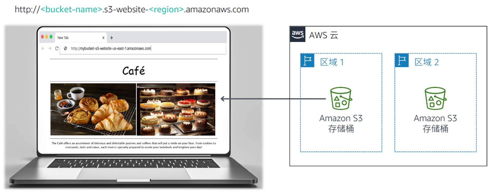

<!-- Font Awesome -->
<link rel="stylesheet" href="https://use.fontawesome.com/releases/v5.11.2/css/all.css">
<style type="text/css">
    #ssb_alexa_blue {
        background-color: #3366ff;
        font-weight: bold;
        font-size: 90%;
        color: white;
        position: relative;
        top: -1px;
        padding-top: 3px;
        padding-bottom: 3px;
        padding-left: 10px;
        padding-right: 10px;
        border-color: #3366ff;
        border-radius: 2px;
        white-space: nowrap
    }
    #ssb_alexa_ocean {
        background-color: #00a0d2;
        font-weight: bold;
        font-size: 90%;
        color: white;
        position: relative;
        top: -1px;
        padding-top: 3px;
        padding-bottom: 3px;
        padding-left: 10px;
        padding-right: 10px;
        border-color: #00a0d2;
        white-space: nowrap
    }
    #ssb_alexa_sand {
        background-color: #f2f2f2;
        font-weight: bold;
        font-size: 90%;
        color: #00a0d2;
        position: relative;
        top: -1px;
        border-color: #dcdcdc;
        border-style: solid;
        border-width: 2px;
        padding-top: 3px;
        padding-bottom: 3px;
        padding-left: 10px;
        padding-right: 10px;
        white-space: nowrap
    }
    #ssb_alexa_white {
        background-color: white;
        font-weight: bold;
        font-size: 90%;
        color: #00a0d2;
        position: relative;
        top: -1px;
        border-color: #00a0d2;
        border-style: solid;
        border-width: 2px;
        padding-top: 3px;
        padding-bottom: 3px;
        padding-left: 10px;
        padding-right: 10px;
        white-space: nowrap
    }
    #ssb_blue {
        background-color: #257ACF;
        font-weight: bold;
        font-size: 90%;
        color: white;
        position: relative;
        top: -1px;
        border-radius: 5px;
        padding-top: 3px;
        padding-bottom: 3px;
        padding-left: 10px;
        padding-right: 10px;
        white-space: nowrap
    }
    #ssb_catalog_orange {
        background-color: #E36000;
        font-weight: bold;
        font-size: 90%;
        color: white;
        position: relative;
        top: -1px;
        border-radius: 1px;
        padding-top: 3px;
        padding-bottom: 3px;
        padding-left: 10px;
        padding-right: 10px;
        white-space: nowrap
    }
    #ssb_catalog_red {
        background-color: #D90000;
        font-weight: bold;
        font-size: 90%;
        color: white;
        position: relative;
        top: -1px;
        border-radius: 5px;
        padding-top: 3px;
        padding-bottom: 3px;
        padding-left: 10px;
        padding-right: 10px;
        white-space: nowrap
    }
    #ssb_dark_blue {
        color: white;
        background-color: darkblue;
        border-radius: 3px;
        padding: 0px 6px;
        white-space: nowrap
    }
    #ssb_grafana_blue {
        background-color: #00678b;
        font-weight: bold;
        font-size: 90%;
        color: white;
        position: relative;
        top: -1px;
        padding-top: 3px;
        padding-bottom: 3px;
        padding-left: 10px;
        padding-right: 10px;
        border-color: #00678b;
        border-radius: 2px;
        white-space: nowrap
    }
    #ssb_grafana_green {
        background-color: #629300;
        font-weight: bold;
        font-size: 90%;
        color: white;
        position: relative;
        top: -1px;
        padding-top: 3px;
        padding-bottom: 3px;
        padding-left: 10px;
        padding-right: 10px;
        border-color: #629300;
        border-radius: 2px;
        white-space: nowrap
    }
    #ssb_grafana_orange {
        background-color: #ec8427;
        font-weight: bold;
        font-size: 90%;
        color: white;
        position: relative;
        top: -1px;
        padding-top: 3px;
        padding-bottom: 3px;
        padding-left: 10px;
        padding-right: 10px;
        border-color: #ec8427;
        border-radius: 2px;
        white-space: nowrap
    }
    #ssb_grey {
        background-color: #DEDEDE;
        font-weight: bold;
        font-size: 90%;
        color: #444;
        position: relative;
        top: -1px;
        border-radius: 5px;
        border-width: 1px;
        border-style: solid;
        border-color: #444;
        padding-top: 3px;
        padding-bottom: 3px;
        padding-left: 10px;
        padding-right: 10px;
        white-space: nowrap
    }
    #ssb_grey_square {
        background-color: #DEDEDE;
        font-weight: bold;
        font-size: 90%;
        color: #444;
        position: relative;
        top: -1px;
        border-radius: 1px;
        border-width: 1px;
        border-style: solid;
        border-color: #444;
        padding-top: 2px;
        padding-bottom: 2px;
        padding-left: 10px;
        padding-right: 10px;
        white-space: nowrap
    }
    #ssb_iot_blue {
        background-color: #00A1C9;
        font-weight: bold;
        font-size: 90%;
        color: white;
        position: relative;
        top: -1px;
        padding-top: 3px;
        padding-bottom: 3px;
        padding-left: 10px;
        padding-right: 10px;
        border-color: #00A1C9;
        border-radius: 2px;
        white-space: nowrap
    }
    #ssb_iot_grey {
        background-color: white;
        font-weight: bold;
        font-size: 90%;
        color: gray;
        position: relative;
        top: -1px;
        border-color: gray;
        border-radius: 2px;
        border-style: solid;
        border-width: 1px;
        padding-top: 3px;
        padding-bottom: 3px;
        padding-left: 10px;
        padding-right: 10px;
        white-space: nowrap
    }
    #ssb_iot_white {
        background-color: white;
        font-weight: bold;
        font-size: 90%;
        color: #00A1C9;
        position: relative;
        top: -1px;
        border-color: #00A1C9;
        border-radius: 2px;
        border-style: solid;
        border-width: 1px;
        padding-top: 3px;
        padding-bottom: 3px;
        padding-left: 10px;
        padding-right: 10px;
        white-space: nowrap
    }
    #ssb_kibana_blue {
        background-color: #0079a5;
        font-weight: bold;
        font-size: 90%;
        color: white;
        position: relative;
        top: -1px;
        padding-top: 3px;
        padding-bottom: 3px;
        padding-left: 10px;
        padding-right: 10px;
        border-color: #0079a5;
        border-radius: 2px;
        white-space: nowrap
    }
    #ssb_kibana_white {
        background-color: white;
        font-weight: bold;
        font-size: 90%;
        color: #0079a5;
        position: relative;
        top: -1px;
        border-color: #0079a5;
        border-radius: 2px;
        border-width: 1px;
        border-style: solid;
        padding-top: 3px;
        padding-bottom: 3px;
        padding-left: 10px;
        padding-right: 10px;
        white-space: nowrap
    }
    #ssb_lambda_orange {
        background-color: #ec7211;
        font-weight: bold;
        font-size: 90%;
        color: white;
        position: relative;
        top: -1px;
        padding-top: 3px;
        padding-bottom: 3px;
        padding-left: 10px;
        padding-right: 10px;
        white-space: nowrap
    }
    #ssb_lambda_white {
        background-color: white;
        font-weight: bold;
        font-size: 90%;
        color: #545b64;
        position: relative;
        top: -1px;
        border-color: #545b64;
        border-radius: 2px;
        border-width: 1px;
        border-style: solid;
        padding-top: 3px;
        padding-bottom: 3px;
        padding-left: 10px;
        padding-right: 10px;
        white-space: nowrap
    }
    #ssb_maroon {
        color: white;
        background-color: darkred;
        border-radius: 3px;
        padding: 0px 6px;
        white-space: nowrap
    }
    #ssb_orange {
        background-color: #ec7211;
        font-weight: bold;
        font-size: 90%;
        color: white;
        position: relative;
        top: -1px;
        padding-top: 3px;
        padding-bottom: 3px;
        padding-left: 10px;
        padding-right: 10px;
        white-space: nowrap
    }
    #ssl_orange {
        color: #ec7211;
        font-weight: bold
    }
    #ssb_orange_oval {
        background-color: #ec7211;
        font-weight: bold;
        font-size: 90%;
        color: white;
        position: relative;
        top: -1px;
        padding-top: 3px;
        padding-bottom: 3px;
        padding-left: 10px;
        padding-right: 10px;
        border-radius: 20px;
        white-space: nowrap
    }
    #ssb_oval {
        background-color: #DEDEDE;
        font-weight: bold;
        font-size: 90%;
        color: #444;
        position: relative;
        top: -1px;
        border-radius: 20px;
        border-width: 1px;
        border-style: solid;
        border-color: #444;
        padding-top: 3px;
        padding-bottom: 3px;
        padding-left: 10px;
        padding-right: 10px;
    }
    #ssb_start_lab {
        background-color: #34A853;
        font-weight: bold;
        font-size: 90%;
        color: white;
        border-radius: 2px;
        padding-left: 10px;
        padding-right: 10px;
        padding-top: 3px;
        padding-bottom: 3px
    }
    #ssb_open_console {
        background-color: white;
        font-family: Google Sans;
        font-weight: bold;
        font-size: 90%;
        color: #1a73e8;
        border-color: #dadce0;
        border-radius: 4px;
        border-width: 2px;
        border-style: solid;
        outline-color: #ffffff;
        padding-top: 5px;
        padding-bottom: 5px;
        padding-left: 10px;
        padding-right: 10px
    }
    #ssb_rds_white {
        background-color: white;
        font-weight: bold;
        font-size: 90%;
        color: #545b64;
        position: relative;
        top: -1px;
        border-color: #545b64;
        border-radius: 2px;
        border-width: 1px;
        border-style: solid;
        padding-top: 3px;
        padding-bottom: 3px;
        padding-left: 10px;
        padding-right: 10px;
    }
    #ssb_red {
        background-color: #D93025;
        font-weight: bold;
        font-size: 90%;
        color: white;
        border-radius: 2px;
        padding-left: 10px;
        padding-right: 10px;
        padding-top: 3px;
        padding-bottom: 3px
    }
    #ssb_red_oval {
        background-color: #D93025;
        font-weight: bold;
        font-size: 90%;
        color: white;
        position: relative;
        top: -1px;
        padding-top: 3px;
        padding-bottom: 3px;
        padding-left: 10px;
        padding-right: 10px;
        border-radius: 20px;
        white-space: nowrap
    }
    #ssb_s3_blue {
        background-color: #329AD6;
        font-weight: bold;
        font-size: 90%;
        color: white;
        position: relative;
        top: -1px;
        padding-top: 3px;
        padding-bottom: 3px;
        padding-left: 10px;
        padding-right: 10px;
    }
    #ssb_s3_white {
        background-color: white;
        font-weight: bold;
        font-size: 90%;
        color: #329AD6;
        position: relative;
        top: -1px;
        border-color: #329AD6;
        border-width: 1px;
        border-style: solid;
        padding-top: 3px;
        padding-bottom: 3px;
        padding-left: 10px;
        padding-right: 10px;
    }
    #ssb_services {
        background-color: #232f3e;
        font-weight: bold;
        font-size: 90%;
        color: white;
        position: relative;
        top: -1px;
        padding-top: 3px;
        padding-bottom: 3px;
        padding-left: 10px;
        padding-right: 10px;
    }
    #ssb_square_lex {
        background-color: white;
        font-weight: bold;
        font-size: 90%;
        color: #1166bb;
        position: relative;
        top: -1px;
        border-color: #c4cbcd;
        border-style: solid;
        border-width: 2px;
        padding-top: 3px;
        padding-bottom: 3px;
        padding-left: 10px;
        padding-right: 10px
    }
    #ssb_ssm_white {
        background-color: white;
        font-weight: bold;
        font-size: 90%;
        color: #545b64;
        position: relative;
        top: -1px;
        border-color: #545b64;
        border-radius: 2px;
        border-width: 1px;
        border-style: solid;
        padding-top: 3px;
        padding-bottom: 3px;
        padding-left: 10px;
        padding-right: 10px;
    }
    #ssb_white {
        background-color: white;
        font-weight: bold;
        font-size: 90%;
        color: #545b64;
        position: relative;
        top: -1px;
        border-color: #545b64;
        border-radius: 2px;
        border-width: 1px;
        border-style: solid;
        padding-top: 3px;
        padding-bottom: 3px;
        padding-left: 10px;
        padding-right: 10px;
    }
    #ssbox_cloudformation_blue {
        font-weight: bold;
        background-color: #f1faff;
        font-size: 90%;
        border-color: #00A1C9;
        border-width: 1px;
        border-style: solid;
        padding-top: 3px;
        padding-bottom: 3px;
        padding-left: 10px;
        padding-right: 10px;
    }
    #ssl_alexa_ocean {
        color: #00a0d2;
        font-weight: bold
    }
    #ssl_blue {
        color: #1166bb;
        font-weight: bold
    }
    #ssl_catalog_orange {
        color: #E16706;
        font-weight: bold
    }
    #ssb_codestar_blue {
        background-color: #329AD6;
        font-weight: bold;
        font-size: 80%;
        color: white;
        position: relative;
        top: -1px;
        border-radius: 1px;
        padding-top: 3px;
        padding-bottom: 3px;
        padding-left: 10px;
        padding-right: 10px;
        white-space: nowrap
    }
    #ssb_cognito_blue {
        background-color: #2a7fd4;
        font-weight: bold;
        font-size: 90%;
        color: white;
        position: relative;
        top: -1px;
        padding-top: 3px;
        padding-bottom: 3px;
        padding-left: 10px;
        padding-right: 10px;
        border-color: #0055aa;
        border-radius: 2px;
        white-space: nowrap
    }
    #ssb_eb_blue {
        background-color: #0f6dca;
        font-weight: bold;
        font-size: 90%;
        color: white;
        position: relative;
        top: -1px;
        padding-top: 3px;
        padding-bottom: 3px;
        padding-left: 10px;
        padding-right: 10px;
        border-color: #0055aa;
        border-width: 1px;
        border-style: solid;
        border-radius: 4px;
        white-space: nowrap;
    }
    #ssb_eb_grey {
        background-color: #e5e5e5;
        font-weight: bold;
        font-size: 90%;
        color: 444444;
        position: relative;
        top: -1px;
        padding-top: 3px;
        padding-bottom: 3px;
        padding-left: 10px;
        padding-right: 10px;
        border-color: #bbbbbb;
        border-width: 1px;
        border-style: solid;
        border-radius: 4px;
        white-space: nowrap
    }
    #ssb_voc_grey {
        background-color: #F2F3F4;
        font-size: 90%;
        color: black;
        position: relative;
        top: -1px;
        padding-top: 3px;
        padding-bottom: 3px;
        padding-left: 10px;
        padding-right: 10px;
        border-color: grey;
        border-width: 1px;
        border-style: solid;
        white-space: nowrap
    }
</style>

# 模块 3 挑战实验：为咖啡馆创建静态网站

## 场景

Frank 和 Martha 是一对夫妻，他们经营着一家小咖啡馆，售卖甜点和咖啡。他们的女儿 Sofía 和一位名叫 Nikhil 的中学生也在咖啡馆工作。这家咖啡馆开在一座大城市，只有一家店面，

而且目前没有任何营销策略，大多数时候都是依赖过往的行人自发进店消费。咖啡馆供应的优质甜点和咖啡是有口皆碑的，但如果不是熟客或者有人推荐的话，消费群体还是比较受限的。

Sofía 建议 Frank 和 Martha 提高咖啡馆的社区知名度。目前咖啡馆既没有做过网络宣传，也没有使用过任何云计算服务。不过，这一现状即将发生改变。

<br/>
## 实验概览与目标

在本实验中，您将使用 Amazon Simple Storage Service (Amazon S3) 构建静态网站并实施架构最佳实践来保护和管理您的数据。

完成本实验后，您应当能够：

- 使用 Amazon S3 托管静态网站
- 使用 Amazon S3 通过某种方式保护数据
- 在 Amazon S3 中实施数据生命周期策略
- 在 Amazon S3 中实施灾难恢复 (DR, Disaster Recovery) 策略
<br/>
在本实验结束时，您的架构应与以下示例类似：



<br/>
**注意**：本挑战实验中有几项任务不提供分步说明。您必须通过自行探索来完成这些任务。

<br/>
## 时长

完成本实验大约需要 **60 分钟**。

<br/>
## AWS 服务限制

本实验环境中对 AWS 服务和服务操作的访问可能仅以完成实验说明为限。如果您尝试访问其他服务或者执行本实验所述之外的操作，可能会出错。

<br/>
## 访问 AWS 管理控制台

1. 在本说明上方，选择 <span id="ssb_voc_grey">Start Lab</span>（开始实验）以启动实验。

   此时将打开 **Start Lab**（开始实验）面板，其中显示实验状态。

   **提示**：如果您需要更多时间来完成实验，请重新选择 **Start Lab**（开始实验）按钮来重新启动环境的计时器。

2. 请等待屏幕显示消息 *Lab status: ready*（实验状态：就绪）后，再选择 **X** 关闭 **Start Lab**（开始实验）面板。

3. 在本说明上方，选择 <span id="ssb_voc_grey">AWS</span>。

   此操作将会在新的浏览器标签页中打开 AWS 管理控制台。您将自动登录系统。

   **提示**：如果未打开新的浏览器标签页，那么您的浏览器顶部通常会有一个横幅或图标，同时显示一条消息，指明您的浏览器阻止该网站打开弹出窗口。选择该横幅或图标，然后选择 **Allow pop ups**（允许弹出窗口）。

4. 排列 AWS 管理控制台标签页，使其与本说明并排显示。理想情况下，您将能够同时看到这两个浏览器标签页，从而更轻松地执行实验步骤。

<br/>
## 咖啡馆的业务请求：启动静态网站（挑战 #1）

Sofía 向 Nikhil 提到，她希望为咖啡馆创建网站，直观展示咖啡馆的产品，并向客户提供位置、营业时间和电话号码等业务详细信息。

Nikhil 很高兴能为咖啡馆创建第一个网站。

对于第一个挑战，您将扮演 Nikhil 的角色，使用 Amazon S3 为咖啡馆创建基础网站。

<br/>
### 任务 1：提取本实验所需的文件

在此任务中，您将提取创建静态网站所需的文件。

5. 打开[此 Amazon S3 链接](https://aws-tc-largeobjects.s3-us-west-2.amazonaws.com/ILT-TF-200-ACACAD-20-EN/Module-3-Challenge-Lab/static-website.zip)，下载本实验所需的 *.zip* 文件。

6. 在您的电脑上提取这些文件。请注意，这些文件将包括 *index.html* 文件和两个文件夹，其中包含级联样式表 (CSS, Cascading Style Sheet) 和图像文件。

<br/>
### 任务 2：创建 S3 存储桶来托管静态网站

在此任务中，您将创建 S3 存储桶，并将其配置用于托管静态网站。

7. 打开 **Amazon S3 控制台**。

8. 创建存储桶来托管静态网站。

   - 在 **N. Virginia**（北弗吉尼亚）(us-east-1) AWS 区域创建该存储桶。
   - **提示**：您必须禁用 **Block *all* public access**（阻止所有公开访问）。

9. 在存储桶上启用静态网站托管。
   - **提示**：您将使用 *index.html* 文件作为索引文档。

<br/>
### 任务 3：将内容上传到 S3 存储桶

在此任务中，您要将静态文件上传到 S3 存储桶。

10. 将 *index.html* 文件以及 *css* 和 *images* 文件夹上传到 S3 存储桶。

11. 在单独的 Web 浏览器标签页中，打开静态网站的终端节点链接。

<br/>
#### 回答有关实验的问题

实验结束时，选择上方的 **Submit**（提交）按钮即可记录答案。

12. 查看本实验中的问题。
	- 选择 <span id="ssb_voc_grey">Details <i class="fas fa-angle-down"></i></span>（详细信息）
	 菜单，然后选择 <span id="ssb_voc_grey">Show</span>（显示）。
	- 选择页面底部显示的 **Access the multiple choice questions**（查看单选题）链接。

13. 在加载的页面中，回答第一个问题：

	- **问题 1**：在完成任务 3 后查看网站时，浏览器中是否显示该页面？

  **注意**：请在浏览器标签页中将问题网页保持打开状态。稍后您将在本实验中返回到该网页。

<br/>
### 任务 4：创建存储桶策略以授予公共读取访问权限

Frank 分享了他为咖啡馆推出*多种*新式甜点的计划。现在您需要为他制作的每种新甜点上传一张图片，并允许公开访问该对象。由于不想手动执行此过程，您决定创建存储桶策略，以使每个对象在上传到文件夹后自动公开。

14. 使用存储桶策略编辑器可以创建为公共匿名用户授予只读权限的存储桶策略。

  **提示**：如果您遇到困难，请参阅 [AWS 文档](https://docs.aws.amazon.com/AmazonS3/latest/dev/example-bucket-policies.html)中的示例。

15. 请确认咖啡馆网站现在可供公开访问。

<br/>
*恭喜*！咖啡馆静态网站创建成功。
<br/>

## 新业务要求：保护网站数据（挑战 #2）

您向 Sofía 展示了新网站，她非常惊喜。做得好！

您和 Sofía 讨论，随着咖啡馆产品种类的增加，您可能需要对网站进行多项更新。

AWS 解决方案架构师 Olivia 是咖啡馆的常客，她建议您实施一项策略来防止意外覆盖和删除网站对象。

您本来就需要更新网站，所以也想把握这次探究对象版本控制的好机会。

<br/>
### 任务 5：对 S3 存储桶启用版本控制

在此任务中，您将对 S3 存储桶启用版本控制并确认该机制工作正常。

16. 在 S3 控制台中，对 S3 存储桶启用版本控制。

  **注意**：请注意，版本控制一经启用便无法禁用。

17. 在常用的文本编辑器中，打开 *index.html* 文件。例如，您可以使用 Notepad++ 或 TextWrangler。

18. 根据以下说明修改文件：
    - 在 HTML 中找到嵌入了 CSS 代码 **bgcolor="aquamarine"** 的第一行，并将其更改为 `bgcolor="gainsboro"`。
    - 在 HTML 中找到嵌入了 CSS 代码 **bgcolor="orange"** 的行，并将其更改为 `bgcolor="cornsilk"`。
    - 在 HTML 中找到嵌入了 CSS 代码 **bgcolor="aquamarine"** 的第二行，并将其更改为 `bgcolor="gainsboro"`。
    - 保存更改。

19. 将更新后的文件上传到 S3 存储桶。

20. 在 Web 浏览器标签页中重新加载网站，并注意这些更改。

21. 要查看最新版本的 *index.html* 文件，请转至存储桶并选择 **List versions**（列出版本）。此时下拉菜单应显示该文件的两个版本。

22. 返回到包含本实验单选题的浏览器标签页，并回答以下问题：

	- **问题 2**：要最大程度地保护数据并防止意外删除已保存的版本，还可以采用什么方法？（**提示**：查看 [Amazon S3 常见问题解答](https://aws.amazon.com/s3/faqs/)。）

<br/>
<br/>
**架构最佳实践**

在此任务中，您使用了一种方法来实施有关*保护数据*的架构最佳实践。

<details>
	<summary>在<b>此处</b>展开以了解详情。</summary>
	根据 <a href = https://d1.awsstatic.com/whitepapers/architecture/AWS_Well-Architected_Framework.pdf>Well-Architected Framework</a>，版本控制应成为大型数据生命周期管理过程的其中一环。在搭建任何系统架构之前，都应将影响安全性的基础实践落实到位。例如，可以通过<i>数据分类</i>将企业数据分为不同的敏感性级别，或通过<i>加密</i>以难以破解的方式呈现数据，从而防范未经授权的访问。这些工具和技术有助于防止财务损失、遵从监管义务等，其重要程度可见一斑。
</details>

<br/>
## 新业务要求：优化 S3 对象存储的成本（挑战 #3）

目前已启用版本控制，您意识到 S3 存储桶的大小将随着新对象和版本的上传而不断增长。为了节省成本，您决定实施一种策略来停用一些旧版本。

<br/>
### 任务 6：设置生命周期策略

在此任务中，您将设置一种生命周期策略，从而让源存储桶中的旧版对象自动移至 S3 标准 – 不频繁访问存储 (S3 Standard-IA)。根据该策略，对象最终将会过期。

23. 在网站存储桶的生命周期配置中配置两个规则。要获得理想效果，应创建两个单独的规则。不要在单个规则中配置两种过渡：
     - 配置一个规则，让所有源存储桶对象的先前版本在 30 天后移至 S3 Standard-IA
     - 再配置另一个规则，让系统在 365 天后删除对象的先前版本
     <br/>**提示**：如果您遇到困难，请参阅 [AWS 文档](https://docs.aws.amazon.com/AmazonS3/latest/user-guide/create-lifecycle.html)以获得指导信息。
     <br/>
     **注意**：要将*复制的范围限定为*某个特定的存储桶对象（例如 *index.html* 文件），请先为该对象创建标签，然后再创建生命周期规则。
     <br/>

很好！现在您成功完成了一项生命周期配置，该配置在 30 天后将源存储桶对象的先前版本移至 S3 Standard-IA。该策略还将在 365 天后永久删除 S3 Standard-IA 中的对象。

<br/>
**架构最佳实践**

在此任务中，您实施了有关*定义数据生命周期管理*的架构最佳实践。

<details>
	<summary>在<b>此处</b>展开以了解详情。</summary>
	根据 <a href = https://d1.awsstatic.com/whitepapers/architecture/AWS_Well-Architected_Framework.pdf>Well-Architected Framework</a>，在实践中，您的生命周期策略应基于数据的<i>关键性和敏感性</i>以及<i>法律和组织要求</i>。您应考虑数据留存持续时间、数据销毁、数据访问管理、数据转换和数据共享等因素。
</details>

<br/>
## 新业务要求：增强持久性并规划 DR（挑战 #4）

当 Olivia 又一次光顾咖啡馆时，您告诉她网站更新了。您向她描述了自己采取的防止网站静态文件被意外覆盖或删除的措施。Olivia 告诉您，Amazon S3 还有一项跨区域复制功能，这个功能也可以用来备份和归档关键数据。

<br/>
### 任务 7：启用跨区域复制

在此任务中，您将对源 S3 存储桶启用跨区域复制。

24. 在除源存储桶所在区域之外的区域中创建第二个存储桶并启用版本控制。第二个存储桶是您的*目标存储桶*。

25. 在源 S3 存储桶上启用跨区域复制。在创建复制规则时，请务必：
     - 复制整个源存储桶。
     - 将 **CafeRole** 用作 AWS Identity and Access Management (IAM) 角色。此 IAM 角色向 Amazon S3 授予从源存储桶读取对象并复制到目标存储桶的权限。
     - 如果出现警告 *The replication rule is saved, but it might not work*（复制规则已保存，但可能不起作用），您可以忽略该警告并继续执行下一步。
     <br/>
     **提示**：如果您遇到困难，请参阅 [AWS 文档](https://docs.aws.amazon.com/AmazonS3/latest/user-guide/enable-replication.html#enable-replication-add-rule)以获得指导信息。
     <br/>
     **注意**：*CafeRole* 拥有以下权限：

```yaml
Version: 2012-10-17
Statement:
  - Action:
	- s3:ListBucket
	- s3:ReplicateObject
	- s3:ReplicateDelete
	- s3:ReplicateTags
	- s3:Get*
    Resource:
	- '*'
    Effect: Allow
```

此访问策略允许该角色对*所有* S3 存储桶执行复制任务。在实际生产环境中，您应将策略限制为仅应用于源和目标 S3 存储桶。有关创建 IAM 角色的更多信息，请参阅[设置复制权限](https://docs.aws.amazon.com/AmazonS3/latest/dev/setting-repl-config-perm-overview.html)。
<br/>
26. 返回到包含本实验单选题的浏览器标签页，并回答以下问题：

	- **问题 3**：目标存储桶中是否包含源存储桶中的对象？

27. 对 *index.html* 文件进行少量更改，并将新版本上传到源存储桶。

28. 验证源存储桶中现在是否包含三个版本的 *index.html* 文件。

29. 确认新对象已复制到目标存储桶。您可能需要重新加载浏览器标签页。

30. 转至源存储桶并删除最新版本。

31. 返回到包含本实验单选题的浏览器标签页，并回答以下问题：

	- **问题 4**：刚从源存储桶中删除的版本是否也将从目标存储桶中删除？

<br/>
**架构最佳实践**

在此任务中，您实施了有关*自动实施灾难恢复*的架构最佳实践。

<details>
	<summary>在<b>此处</b>展开以了解详情。</summary>
	根据 <a href = https://d1.awsstatic.com/whitepapers/architecture/AWS_Well-Architected_Framework.pdf>Well-Architected Framework</a>，DR 策略首先会<i>准备好备份和冗余工作负载组件</i>。您应该使用 AWS 或第三方工具，自动实施系统恢复并将流量路由到 DR 站点或区域。
</details>

<br/>
## 提交作业

32. 在本说明上方，选择 <span id="ssb_blue">Submit</span>（提交）以记录您的进度，并在出现提示时选择 **Yes**（是）。

33. 如果在几分钟后仍未显示结果，请返回到本说明上方，并选择 <span id="ssb_voc_grey">Grades</span>（成绩）

     **提示**：您可以多次提交作业。更改作业后，再次选择 **Submit**（提交）。您最后一次提交的作业将记为本实验内容的作业。

34. 要查找有关作业的详细反馈，请选择 <span id="ssb_voc_grey">Details</span>（详细信息），然后选择 <i class="fas fa-caret-right"></i> **View Submission Report**（查看提交报告）。

<br/>

## 实验完成

<i class="fas fa-flag-checkered"></i> 恭喜！您已完成本实验。

35. 要确认您希望结束实验，请选择此页面顶部的 **<span id="ssb_voc_grey">End Lab</span>**（结束实验），然后选择 **<span id="ssb_blue">Yes</span>**（是）。

    此时应显示一个面板，其中包含这样一条消息：_DELETE has been initiated...You may close this message box now._（删除操作已启动... 您现在可以关闭此消息框）。

36. 选择右上角的 **X** 关闭面板。


<br/>
*©2023 Amazon Web Services, Inc. 和其附属公司。保留所有权利。未经 Amazon Web Services, Inc. 事先书面许可，不得复制或转载本文的部分或全部内容。禁止因商业目的复制、出借或出售本文。*
