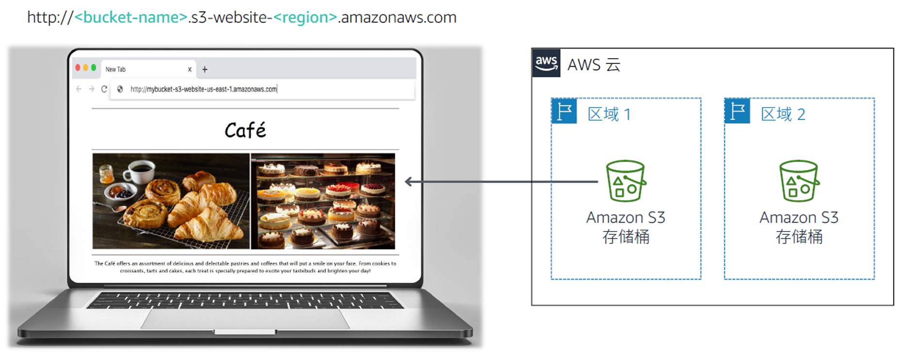

# 模組 3 挑戰實驗：為咖啡館創建靜態網站

## 場景

Frank 和 Martha 是一對夫妻，他們經營著一家小咖啡館，售賣甜點和咖啡。他們的女兒 Sofía 和一位名叫 Nikhil 的中學生也在咖啡館工作。這家咖啡館開在一座大城市，只有一家店面，

而且目前沒有任何行銷策略，大多數時候都是依賴過往的行人自發進店消費。咖啡館供應的優質甜點和咖啡是有口皆碑的，但如果不是熟客或者有人推薦的話，消費群體還是比較受限的。

Sofía 建議 Frank 和 Martha 提高咖啡館的社區知名度。目前咖啡館既沒有做過網路宣傳，也沒有使用過任何雲計算服務。不過，這一現狀即將發生改變。

## 實驗概覽與目標

在本實驗中，您將使用 Amazon Simple Storage Service (Amazon S3) 構建靜態網站並實施架構最佳實踐來保護和管理您的資料。

完成本實驗後，您應當能夠：

- 使用 Amazon S3 託管靜態網站
- 使用 Amazon S3 通過某種方式保護資料
- 在 Amazon S3 中實施資料生命週期策略
- 在 Amazon S3 中實施災難恢復 (DR, Disaster Recovery) 策略

在本實驗結束時，您的架構應與以下示例類似：



**注意**：本挑戰實驗中有幾項任務不提供分步說明。您必須通過自行探索來完成這些任務。

## 時長

完成本實驗大約需要 **60 分鐘**。

## AWS 服務限制

本實驗環境中對 AWS 服務和服務操作的訪問可能僅以完成實驗說明為限。如果您嘗試訪問其他服務或者執行本實驗所述之外的操作，可能會出錯。

## 訪問 AWS 管理主控台

1. 在本說明上方，選擇 <span id="ssb_voc_grey">Start Lab</span>（開始實驗）以啟動實驗。

   此時將打開 **Start Lab**（開始實驗）面板，其中顯示實驗狀態。

   **提示**：如果您需要更多時間來完成實驗，請重新選擇 **Start Lab**（開始實驗）按鈕來重新開機環境的計時器。

2. 請等待螢幕顯示消息 *Lab status: ready*（實驗狀態：就緒）後，再選擇 **X** 關閉 **Start Lab**（開始實驗）面板。

3. 在本說明上方，選擇 <span id="ssb_voc_grey">AWS</span>。

   此操作將會在新的流覽器標籤頁中打開 AWS 管理主控台。您將自動登錄系統。

   **提示**：如果未打開新的流覽器標籤頁，那麼您的流覽器頂部通常會有一個橫幅或圖示，同時顯示一條消息，指明您的流覽器阻止該網站打開快顯視窗。選擇該橫幅或圖示，然後選擇 **Allow pop ups**（允許快顯視窗）。

4. 排列 AWS 管理主控台標籤頁，使其與本說明並排顯示。理想情況下，您將能夠同時看到這兩個流覽器標籤頁，從而更輕鬆地執行實驗步驟。

## 咖啡館的業務請求：啟動靜態網站（挑戰 #1）

Sofía 向 Nikhil 提到，她希望為咖啡館創建網站，直觀展示咖啡館的產品，並向客戶提供位置、營業時間和電話號碼等業務詳細資訊。

Nikhil 很高興能為咖啡館創建第一個網站。

對於第一個挑戰，您將扮演 Nikhil 的角色，使用 Amazon S3 為咖啡館創建基礎網站。

### 任務 1：提取本實驗所需的檔

在此任務中，您將提取創建靜態網站所需的檔。

5. 打開[此 Amazon S3 連結](https://aws-tc-largeobjects.s3-us-west-2.amazonaws.com/ILT-TF-200-ACACAD-20-EN/Module-3-Challenge-Lab/static-website.zip)，下載本實驗所需的 *.zip* 文件。

6. 在您的電腦上提取這些檔。請注意，這些檔將包括 *index.html* 檔和兩個資料夾，其中包含階層式樣式表 (CSS, Cascading Style Sheet) 和影像檔。

### 任務 2：創建 S3 存儲桶來託管靜態網站

在此任務中，您將創建 S3 存儲桶，並將其配置用於託管靜態網站。

7. 打開 **Amazon S3 控制台**。

8. 創建存儲桶來託管靜態網站。

   - 在 **N. Virginia**（北維吉尼亞）(us-east-1) AWS 區域創建該存儲桶。
   - **提示**：您必須禁用 **Block *all* public access**（阻止所有公開訪問）。

9. 在存儲桶上啟用靜態網站託管。
   - **提示**：您將使用 *index.html* 檔作為索引文檔。

### 任務 3：將內容上傳到 S3 存儲桶

在此任務中，您要將靜態檔上傳到 S3 存儲桶。

10. 將 *index.html* 檔以及 *css* 和 *images* 資料夾上傳到 S3 存儲桶。

11. 在單獨的 Web 流覽器標籤頁中，打開靜態網站的終端節點連結。

#### 回答有關實驗的問題

實驗結束時，選擇上方的 **Submit**（提交）按鈕即可記錄答案。

12. 查看本實驗中的問題。
	- 選擇 <span id="ssb_voc_grey">Details <i class="fas fa-angle-down"></i></span>（詳細資訊）
	 功能表，然後選擇 <span id="ssb_voc_grey">Show</span>（顯示）。
	- 選擇頁面底部顯示的 **Access the multiple choice questions**（查看單選題）連結。

13. 在載入的頁面中，回答第一個問題：

	- **問題 1**：在完成任務 3 後查看網站時，流覽器中是否顯示該頁面？

  **注意**：請在流覽器標籤頁中將問題網頁保持打開狀態。稍後您將在本實驗中返回到該網頁。

### 任務 4：創建存儲桶策略以授予公共讀取存取權限

Frank 分享了他為咖啡館推出*多種*新式甜點的計畫。現在您需要為他製作的每種新甜點上傳一張圖片，並允許公開訪問該物件。由於不想手動執行此過程，您決定創建存儲桶策略，以使每個物件在上傳到資料夾後自動公開。

14. 使用存儲桶策略編輯器可以創建為公共匿名使用者授予唯讀許可權的存儲桶策略。

  **提示**：如果您遇到困難，請參閱 [AWS 文檔](https://docs.aws.amazon.com/AmazonS3/latest/dev/example-bucket-policies.html)中的示例。

15. 請確認咖啡館網站現在可供公開訪問。

*恭喜*！咖啡館靜態網站創建成功。

## 新業務要求：保護網站資料（挑戰 #2）

您向 Sofía 展示了新網站，她非常驚喜。做得好！

您和 Sofía 討論，隨著咖啡館產品種類的增加，您可能需要對網站進行多項更新。

AWS 解決方案架構師 Olivia 是咖啡館的常客，她建議您實施一項策略來防止意外覆蓋和刪除網站對象。

您本來就需要更新網站，所以也想把握這次探究物件版本控制的好機會。

### 任務 5：對 S3 存儲桶啟用版本控制

在此任務中，您將對 S3 存儲桶啟用版本控制並確認該機制工作正常。

16. 在 S3 控制台中，對 S3 存儲桶啟用版本控制。

  **注意**：請注意，版本控制一經啟用便無法禁用。

17. 在常用的文字編輯器中，打開 *index.html* 文件。例如，您可以使用 Notepad++ 或 TextWrangler。

18. 根據以下說明修改檔：
    - 在 HTML 中找到嵌入了 CSS 代碼 **bgcolor="aquamarine"** 的第一行，並將其更改為 `bgcolor="gainsboro"`。
    - 在 HTML 中找到嵌入了 CSS 代碼 **bgcolor="orange"** 的行，並將其更改為 `bgcolor="cornsilk"`。
    - 在 HTML 中找到嵌入了 CSS 代碼 **bgcolor="aquamarine"** 的第二行，並將其更改為 `bgcolor="gainsboro"`。
    - 保存更改。

19. 將更新後的檔上傳到 S3 存儲桶。

20. 在 Web 流覽器標籤頁中重新載入網站，並注意這些更改。

21. 要查看最新版本的 *index.html* 檔，請轉至存儲桶並選擇 **List versions**（列出版本）。此時下拉式功能表應顯示該檔的兩個版本。

22. 返回到包含本實驗單選題的流覽器標籤頁，並回答以下問題：

	- **問題 2**：要最大程度地保護資料並防止意外刪除已保存的版本，還可以採用什麼方法？（**提示**：查看 [Amazon S3 常見問題解答](https://aws.amazon.com/s3/faqs/)。）

**架構最佳實踐**

在此任務中，您使用了一種方法來實施有關*保護資料*的架構最佳實踐。

<details>
	<summary>在<b>此處</b>展開以瞭解詳情。</summary>
	根據 <a href = https://d1.awsstatic.com/whitepapers/architecture/AWS_Well-Architected_Framework.pdf>Well-Architected Framework</a>，版本控制應成為大型資料生命週期管理過程的其中一環。在搭建任何系統架構之前，都應將影響安全性的基礎實踐落實到位。例如，可以通過<i>資料分類</i>將企業資料分為不同的敏感性級別，或通過<i>加密</i>以難以破解的方式呈現資料，從而防範未經授權的訪問。這些工具和技術有助於防止財務損失、遵從監管義務等，其重要程度可見一斑。
</details>

## 新業務要求：優化 S3 物件存儲的成本（挑戰 #3）

目前已啟用版本控制，您意識到 S3 存儲桶的大小將隨著新物件和版本的上傳而不斷增長。為了節省成本，您決定實施一種策略來停用一些舊版本。

### 任務 6：設置生命週期策略

在此任務中，您將設置一種生命週期策略，從而讓源存儲桶中的舊版物件自動移至 S3 標準 – 不頻繁訪問存儲 (S3 Standard-IA)。根據該策略，物件最終將會過期。

23. 在網站存儲桶的生命週期配置中配置兩個規則。要獲得理想效果，應創建兩個單獨的規則。不要在單個規則中配置兩種過渡：
     - 配置一個規則，讓所有源存儲桶物件的先前版本在 30 天后移至 S3 Standard-IA
     - 再配置另一個規則，讓系統在 365 天后刪除物件的先前版本
     <br/>**提示**：如果您遇到困難，請參閱 [AWS 文檔](https://docs.aws.amazon.com/AmazonS3/latest/user-guide/create-lifecycle.html)以獲得指導資訊。
     <br/>
     **注意**：要將*複製的範圍限定為*某個特定的存儲桶物件（例如 *index.html* 檔），請先為該物件創建標籤，然後再創建生命週期規則。
     <br/>

很好！現在您成功完成了一項生命週期配置，該配置在 30 天后將源存儲桶物件的先前版本移至 S3 Standard-IA。該策略還將在 365 天后永久刪除 S3 Standard-IA 中的物件。

**架構最佳實踐**

在此任務中，您實施了有關*定義資料生命週期管理*的架構最佳實踐。

<details>
	<summary>在<b>此處</b>展開以瞭解詳情。</summary>
	根據 <a href = https://d1.awsstatic.com/whitepapers/architecture/AWS_Well-Architected_Framework.pdf>Well-Architected Framework</a>，在實踐中，您的生命週期策略應基於資料的<i>關鍵性和敏感性</i>以及<i>法律和組織要求</i>。您應考慮資料留存持續時間、資料銷毀、資料訪問管理、資料轉換和資料共用等因素。
</details>

## 新業務要求：增強持久性並規劃 DR（挑戰 #4）

當 Olivia 又一次光顧咖啡館時，您告訴她網站更新了。您向她描述了自己採取的防止網站靜態檔被意外覆蓋或刪除的措施。Olivia 告訴您，Amazon S3 還有一項跨區域複製功能，這個功能也可以用來備份和歸檔關鍵資料。

### 任務 7：啟用跨區域複製

在此任務中，您將對源 S3 存儲桶啟用跨區域複製。

24. 在除源存儲桶所在區域之外的區域中創建第二個存儲桶並啟用版本控制。第二個存儲桶是您的*目標存儲桶*。

25. 在源 S3 存儲桶上啟用跨區域複製。在創建複製規則時，請務必：
     - 複製整個源存儲桶。
     - 將 **CafeRole** 用作 AWS Identity and Access Management (IAM) 角色。此 IAM 角色向 Amazon S3 授予從源存儲桶讀取物件並複製到目標存儲桶的許可權。
     - 如果出現警告 *The replication rule is saved, but it might not work*（複製規則已保存，但可能不起作用），您可以忽略該警告並繼續執行下一步。
     <br/>
     **提示**：如果您遇到困難，請參閱 [AWS 文檔](https://docs.aws.amazon.com/AmazonS3/latest/user-guide/enable-replication.html#enable-replication-add-rule)以獲得指導資訊。
     <br/>
     **注意**：*CafeRole* 擁有以下許可權：

```yaml
Version: 2012-10-17
Statement:
  - Action:
	- s3:ListBucket
	- s3:ReplicateObject
	- s3:ReplicateDelete
	- s3:ReplicateTags
	- s3:Get*
    Resource:
	- '*'
    Effect: Allow
```

此訪問策略允許該角色對*所有* S3 存儲桶執行複製任務。在實際生產環境中，您應將策略限制為僅應用於源和目標 S3 存儲桶。有關創建 IAM 角色的更多資訊，請參閱[設置複製許可權](https://docs.aws.amazon.com/AmazonS3/latest/dev/setting-repl-config-perm-overview.html)。

26. 返回到包含本實驗單選題的流覽器標籤頁，並回答以下問題：

	- **問題 3**：目標存儲桶中是否包含源存儲桶中的物件？

27. 對 *index.html* 檔進行少量更改，並將新版本上傳到源存儲桶。

28. 驗證源存儲桶中現在是否包含三個版本的 *index.html* 文件。

29. 確認新物件已複製到目標存儲桶。您可能需要重新載入流覽器標籤頁。

30. 轉至源存儲桶並刪除最新版本。

31. 返回到包含本實驗單選題的流覽器標籤頁，並回答以下問題：

	- **問題 4**：剛從源存儲桶中刪除的版本是否也將從目標存儲桶中刪除？

**架構最佳實踐**

在此任務中，您實施了有關*自動實施災難恢復*的架構最佳實踐。

<details>
	<summary>在<b>此處</b>展開以瞭解詳情。</summary>
	根據 <a href = https://d1.awsstatic.com/whitepapers/architecture/AWS_Well-Architected_Framework.pdf>Well-Architected Framework</a>，DR 策略首先會<i>準備好備份和冗餘工作負載元件</i>。您應該使用 AWS 或協力廠商工具，自動實施系統恢復並將流量路由到 DR 網站或區域。
</details>

## 提交作業

32. 在本說明上方，選擇 <span id="ssb_blue">Submit</span>（提交）以記錄您的進度，並在出現提示時選擇 **Yes**（是）。

33. 如果在幾分鐘後仍未顯示結果，請返回到本說明上方，並選擇 <span id="ssb_voc_grey">Grades</span>（成績）

     **提示**：您可以多次提交作業。更改作業後，再次選擇 **Submit**（提交）。您最後一次提交的作業將記為本實驗內容的作業。

34. 要查找有關作業的詳細回饋，請選擇 <span id="ssb_voc_grey">Details</span>（詳細資訊），然後選擇 <i class="fas fa-caret-right"></i> **View Submission Report**（查看提交報告）。


## 實驗完成

<i class="fas fa-flag-checkered"></i> 恭喜！您已完成本實驗。

35. 要確認您希望結束實驗，請選擇此頁面頂部的 **<span id="ssb_voc_grey">End Lab</span>**（結束實驗），然後選擇 **<span id="ssb_blue">Yes</span>**（是）。

    此時應顯示一個面板，其中包含這樣一條消息：_DELETE has been initiated...You may close this message box now._（刪除操作已啟動... 您現在可以關閉此訊息方塊）。

36. 選擇右上角的 **X** 關閉面板。


*©2023 Amazon Web Services, Inc. 和其附屬公司。保留所有權利。未經 Amazon Web Services, Inc. 事先書面許可，不得複製或轉載本文的部分或全部內容。禁止因商業目的複製、出借或出售本文。*
