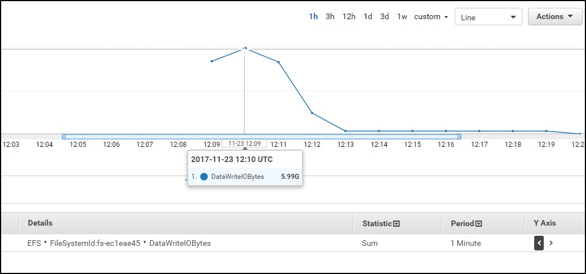

# 模組 4 – 引導式實驗：Amazon Elastic File System (Amazon EFS) 簡介
[//]:# "SKU：ILT-TF-200-ACACAD-2    源課程：SPL-151"

## 實驗概覽與目標
本實驗旨在介紹如何通過 AWS 管理主控台使用 Amazon Elastic File System (Amazon EFS)。

完成本實驗後，您應當能夠：

- 登錄 AWS 管理主控台

- 創建 Amazon EFS 檔案系統

- 登錄到運行 Amazon Linux 的 Amazon Elastic Compute Cloud (Amazon EC2) 實例

- 將檔案系統掛載到 EC2 實例

- 檢查和監控檔案系統的性能

## 時長

完成本實驗大約需要 **20** 分鐘。

## AWS 服務限制

本實驗環境中對 AWS 服務和服務操作的訪問可能僅以完成實驗說明為限。如果您嘗試訪問其他服務或者執行本實驗所述之外的操作，可能會出錯。


## 訪問 AWS 管理主控台

1. 在本說明上方，選擇 <span id="ssb_voc_grey">Start Lab</span>（開始實驗）以啟動實驗。

   此時將打開 **Start Lab**（開始實驗）面板，其中顯示實驗狀態。

   <i class="fas fa-info-circle"></i> **提示**：如果您需要更多時間來完成實驗，請重新選擇 <span id="ssb_voc_grey">Start Lab</span>（開始實驗）按鈕來重新開機環境的計時器。

2. 請等待 **Start Lab**（開始實驗）面板顯示消息 *Lab status: ready*（實驗狀態：就緒）後，再選擇 **X** 關閉該面板。

3. 在本說明上方，選擇 <span id="ssb_voc_grey">AWS</span>。

   此操作將會在新的流覽器標籤頁中打開 AWS 管理主控台。您將自動登錄系統。

   <i class="fas fa-exclamation-triangle"></i> **提示**：如果未打開新的流覽器標籤頁，那麼您的流覽器頂部通常會有一個橫幅或圖示，同時顯示一條消息，指明您的流覽器阻止該網站打開快顯視窗。選擇該橫幅或圖示，然後選擇 **Allow pop ups**（允許快顯視窗）。

4. 排列 **AWS 管理主控台**標籤頁，使其與本說明並排顯示。理想情況下，您將同時打開這兩個流覽器標籤頁，從而更輕鬆地執行實驗步驟。

   <i class="fas fa-exclamation-triangle"></i> **除非特別要求，否則請勿更改區域**。


## 任務 1：創建安全性群組以訪問 EFS 檔案系統

與掛載目標關聯的安全性群組*必須允許網路檔案系統 (NFS, Network File System) 的埠 2049 的 TCP 入站訪問*。這是您即將創建、配置並附加到 EFS 掛載目標的安全性群組。


5. 在 **AWS 管理主控台**的 <span id="ssb_services">Services</span>（服務）功能表上，選擇 **EC2**。

6. 在左側功能窗格中，選擇 **Security Groups**（安全性群組）。

7. 將 *EFSClient* 安全性群組的 **Security group ID**（安全性群組 ID）複製到文字編輯器中。

   組 ID 應類似於 *sg-03727965651b6659b*。

8. 選擇 <span id="ssb_orange">Create security group</span>（創建安全性群組），然後進行以下配置：

   <a id='securitygroup'></a>

    * **Security group name**（安全性群組名稱）：`EFS Mount Target`
    * **Description**（描述）：`Inbound NFS access from EFS clients`
    * **VPC：** *Lab VPC*

9. 在 **Inbound rules**（入站規則）部分中，選擇 <span id="ssb_white">Add rule</span>（添加規則），然後進行以下配置：

    * **Type**（類型）：*NFS*
    * **Source**（源）：
      * *Custom*（自訂）
      * 在 *Custom*（自訂）框中，粘貼複製到文字編輯器中安全性群組的 **Security group ID**（安全性群組 ID）
    * 選擇 <span id="ssb_orange">Create security group</span>（創建安全性群組）。


## 任務 2：創建 EFS 檔案系統

EFS 檔案系統可以掛載到在同一區域內的不同可用區中運行的多個 EC2 實例。這些實例通過標準 NFSv4.1 語義，使用在每個*可用區*中創建的*掛載目標*來掛載檔案系統。您一次只能在一個 virtual private cloud (VPC) 中的實例上掛載檔案系統。檔案系統和 VPC 必須位於同一區域中。


10. 在 <span id="ssb_services">Services</span>（服務）功能表上，選擇 **EFS**。

11. 選擇 <span id="ssb_orange">Create file system</span>（創建檔案系統）

12. 在 **Create file system**（創建檔案系統）視窗中，選擇 <span id="ssb_white">Customize</span>（自訂）

13. 在**步驟 1** 中：

    - 取消選中 <i class="far fa-square"></i> **Enable automatic backups**（啟用自動備份）。
    - **Lifecycle management**（生命週期管理）：選擇 *None*（無）
    - 在 **Tags**（標籤）部分中，進行以下配置：
      - **Key**（鍵）：`Name`
      - **Value**（值）：`My First EFS File System`

14. 選擇 <span id="ssb_orange">Next</span>（下一步）

15. 對於 **VPC**，選擇 *Lab VPC*。

16. 通過選中每個默認安全性群組上的 <i class="fas fa-times"></i> 核取方塊，從每個*可用區*掛載目標分離預設安全性群組。

17. 通過以下方式將 **EFS 掛載目標**安全性群組附加到每個*可用區*掛載目標：

   * 選中每個 **Security groups**（安全性群組）核取方塊。
   * 選擇 **EFS Mount Target**（EFS 掛載目標）。

     此時將為每個子網創建一個掛載目標。

     您的掛載目標應如以下示例所示。該圖顯示了 **Lab VPC** 中使用 **EFS Mount Target**（EFS 掛載目標）安全性群組的兩個掛載目標。在本實驗中，您應使用 **Lab VPC**。

     

18. 選擇 <span id="ssb_orange">Next</span>（下一步）

19. 在**步驟 3** 中，選擇 <span id="ssb_orange">Next</span>（下一步）

20. 在**步驟 4** 中：

  * 查看配置。
  * 選擇 <span id="ssb_orange">Create</span>（創建）

<i class="far fa-thumbs-up"></i> 恭喜！您已在 Lab VPC 中創建新的 EFS 檔案系統，並在每個 Lab VPC 子網中創建了多個掛載目標。幾秒鐘後，檔案系統的 **File system state**（檔案系統狀態）將變成 *Available*（可用），在 2 到 3 分鐘後，掛載目標的狀態將發生更改。

在每個掛載目標的 **Mount target state**（掛載目標狀態）變成 *Available*（可用）之後，繼續下一步。2 到 3 分鐘後，選擇螢幕刷新按鈕以查看其進度。

**注意**：您可能需要在 **File systems**（檔案系統）窗格中滾動至右側，來查找 **File system state**（檔案系統狀態）。


## 任務 3：通過 SSH 連接到 EC2 實例

在此任務中，您將使用 Secure Shell (SSH) 連接到 EC2 實例。

### <i class="fab fa-windows"></i> Microsoft Windows 用戶

<i class="fas fa-comment"></i> 本說明專供 Microsoft Windows 用戶使用。如果您使用的是 macOS 或 Linux，請<a href="#ssh-MACLinux">跳至下一部分</a>。
​

21. 在當前說明的上方，選擇 <span id="ssb_voc_grey">Details</span>（詳細資訊）下拉式功能表，然後選擇 <span id="ssb_voc_grey">Show</span>（顯示）

   此時將打開 **Credentials**（憑證）視窗。

22. 選擇 **Download PPK**（下載 PPK）按鈕並保存 **labsuser.ppk** 文件。

   **注意**：通常，流覽器會將該檔保存到 **Downloads** 目錄中。

23. 記下 **EC2PublicIP** 位址（如果已顯示）。

24. 選擇 **X** 以退出 **Details**（詳細資訊）面板。

25. 要使用 SSH 訪問 EC2 實例，您必須使用 ***\*PuTTY\****。如果您的電腦上沒有安裝 PuTTY，請<a href="https://the.earth.li/~sgtatham/putty/latest/w64/putty.exe">下載 PuTTY</a>。

26. 打開 **putty.exe**。

27. 要使 PuTTY 會話在更長時間內保持打開狀態，請配置 PuTTY 超時：

   * 選擇 **Connection**（連接）
   * **Seconds between keepalives**（兩次 keepalive 之間的秒數）：`30`

28. 使用以下設置配置 PuTTY 會話。

   * 選擇 **Session**（會話）
   * **Host Name (or IP address)**（主機名稱（或 IP 地址））：粘貼您之前記下的實例的 **EC2PublicIP**
     * 或者，返回 Amazon EC2 控制台，然後選擇 **Instances**（實例）
     * 選擇要連接到的實例
     * 在 *Description*（描述）標籤頁中，複製 **IPv4 Public IP**（IPv4 公有 IP）值
   * 回到 PuTTY，在 **Connection**（連接）列表中，展開 <i class="far fa-plus-square"></i> **SSH**
   * 選擇 **Auth**（身份驗證），然後展開 <i class="far fa-plus-square"></i> **Credentials**（憑證）
   * 在* *Private key file for authentication**（用於身份驗證的私有金鑰文件）：下方，選擇 **Browse**（流覽）
   * 流覽找到已下載的 *labsuser.ppk* 文件，選擇該文件，然後選擇 **Open**（打開）
   * 再次選擇 **Open**（打開）


29. 要信任主機並連接到該主機，請選擇 **Accept**（接受）。

30. 在系統提示您輸入 **login as**（登錄身份）時，請輸入：`ec2-user`

    此操作會將您連接到 EC2 實例。

31. Microsoft Windows 用戶：<a href="#ssh-after">選擇此連結跳至下一個任務。</a>


<a id='ssh-MACLinux'></a>

### macOS <span style="font-size: 30px; color: #808080;"><i class="fab fa-apple"></i></span> 和 Linux <span style="font-size: 30px; "><i class="fab fa-linux"></i></span> 用戶

本說明專供 macOS 或 Linux 用戶使用。如果您是 Windows 用戶，<a href="#ssh-after">請跳至下一任務。</a>

32. 在當前說明的上方，選擇 <span id="ssb_voc_grey">Details</span>（詳細資訊）下拉式功能表，然後選擇 <span id="ssb_voc_grey">Show</span>（顯示）

    此時將打開 **Credentials**（憑證）視窗。

33. 選擇 **Download PEM**（下載 PEM）按鈕並保存 **labsuser.pem** 文件。

34. 記下 **EC2PublicIP** 位址（如果已顯示）。

35. 選擇 **X** 以退出 **Details**（詳細資訊）面板。

36. 打開一個終端視窗，並使用 `cd` 命令將目錄更改為下載的 *labsuser.pem* 檔所在的目錄。

    例如，如果 *labsuser.pem* 檔已保存到 **Downloads** 目錄，請運行此命令：

    ```bash
    cd ~/Downloads
    ```

37. 運行此命令，將金鑰的許可權更改為唯讀：

    ```bash
    chmod 400 labsuser.pem
    ```

38. 運行以下命令（將 **<public-ip\>** 替換為之前複製的 **EC2PublicIP** 位址）。

    * 或者，要查找本地部署實例的 IP 位址，請返回 Amazon EC2 控制台並選擇 **Instances**（實例）
    * 選擇要連接到的實例
    * 在 **Description**（描述）標籤頁中，複製 **IPv4 Public IP**（IPv4 公有 IP）值

     ```bash
     ssh -i labsuser.pem ec2-user@<public-ip>
     ```

39. 當系統提示允許首次連接此遠端 SSH 伺服器時，輸入 `yes`。

    由於您使用金鑰對進行身份驗證，系統不會提示您輸入密碼。

<a id='ssh-after'></a>

## 任務 4：創建新目錄並掛載 EFS 檔案系統

<i class="fas fa-info-circle" aria-hidden="true"></i> Amazon EFS 在 EC2 實例上掛載檔案系統時支持 NFSv4.1 和 NFSv4.0 協定。儘管也支援 NFSv4.0，但我們仍建議您使用 NFSv4.1。在 EC2 實例上掛載 EFS 檔案系統時，也必須使用支援所選 NFSv4 協定的 NFS 用戶端。本實驗中啟動的 EC2 實例包括已安裝在該實例上的 NFSv4.1 用戶端。


40. 在 SSH 會話中，輸入 `sudo mkdir efs` 來創建新目錄

41. 返回 **AWS 管理主控台**，在 <span id="ssb_services">Services</span>（服務）功能表上，選擇 **EFS**。

42. 選擇 **My First EFS File System**（我的第一個 EFS 檔案系統）。

43. 在 **Amazon EFS Console**（Amazon EFS 控制台）的頁面右上角，選擇 <span id="ssb_orange">Attach</span>（附加）以打開 Amazon EC2 掛載說明。

44. 複製 **Using the NFS client**（使用 NFS 用戶端）部分中的完整命令。

    掛載命令應類似於以下示例：

    `sudo mount -t nfs4 -o nfsvers=4.1,rsize=1048576,wsize=1048576,hard,timeo=600,retrans=2,noresvport fs-bce57914.efs.us-west-2.amazonaws.com:/ efs`

    <i class="fas fa-comment" aria-hidden="true"></i> 提供的 `sudo mount...` 命令使用預設 Linux 掛載選項。

45. 在 Linux SSH 會話中，通過以下方式掛載 Amazon EFS 檔案系統：

    * 粘貼該命令
    * 按 Enter 鍵


46. 輸入以下內容，獲取可用和已用磁碟空間使用情況的完整摘要：

    `sudo df -hT`

    以下螢幕截圖是 *disk filesystem* 命令的輸出示例：

    `df -hT`
    
    請注意已掛載的 EFS 檔案系統的*類型*和*大小*。

</img>


## 任務 5：檢查新 EFS 檔案系統的性能表現


### 使用 Flexible IO 檢查性能

<i class="fas fa-info-circle"></i> Flexible IO (fio) 是用於 Linux 的合成輸入/輸出基準測試實用工具。該工具用於對 Linux 輸入/輸出子系統進行基準測試和測試。在啟動過程中，*fio* 會自動安裝在 EC2 實例上。

47. 通過輸入以下內容來檢查檔案系統的寫入性能特徵：

    ```
    sudo fio --name=fio-efs --filesize=10G --filename=./efs/fio-efs-test.img --bs=1M --nrfiles=1 --direct=1 --sync=0 --rw=write --iodepth=200 --ioengine=libaio
    ```

    <i class="fas fa-comment"></i> `fio` 命令將需要 5 到 10 分鐘才能完成。輸出應類似於以下螢幕截圖中的示例。請務必檢查 `fio` 命令的輸出，特別是此寫入測試的摘要狀態資訊。

    

### 使用 Amazon CloudWatch 監控性能

48. 在 **AWS 管理主控台**的 <span id="ssb_services">Services</span>（服務）功能表上，選擇 **CloudWatch**。

49. 在左側功能窗格中，選擇 **Metrics**（指標）。

50. 在 **All metrics**（所有指標）標籤頁中，選擇 **EFS**。

51. 選擇 **File System Metrics**（檔案系統指標）。

52. 選擇包含 **PermittedThroughput** 指標名稱的行。

    <i class="fas fa-comment"></i> 您可能需要等待 2 到 3 分鐘並多次刷新螢幕，以便系統計算和填充所有可用指標（包括 **PermittedThroughput**）。

53. 在圖表中，選擇並拖動資料行。如果看不到折線圖，請調整折線圖的時間範圍，以顯示運行 `fio` 命令的時段。

    


54. 將指標停在圖表中的資料行上。該值應為 *105M*。

    
    
    
    Amazon EFS 的輸送量會隨著檔案系統的增大而擴展。基於檔的工作負載通常是高峰工作負載。它們會在短時間內產生高水準的輸送量，而在其餘時間產生低水準的輸送量。鑒於此行為，Amazon EFS 設計為在一段時間內可突增到高輸送量水準。不管大小如何，所有檔案系統都能突增到 100MiB/s 的輸送量。有關 EFS 檔案系統性能特徵的更多資訊，請參閱官方 <a href="http://docs.aws.amazon.com/efs/latest/ug/performance.html" target="_blank">Amazon Elastic File System 文檔</a>。
    
55. 在 **All metrics**（所有指標）標籤頁中，*取消選中* **PermittedThroughput** 對應的框。

56. 選中 **DataWriteIOBytes** 對應的核取方塊。

    <i class="fas fa-comment"></i> 如果指標清單中未顯示 *DataWriteIOBytes*，請使用 **File System Metrics**（檔案系統指標）搜索來查找該指標。

57. 選擇 **Graphed metrics**（圖形化指標）標籤頁。

58. 在 **Statistics**（統計資訊）列中，選擇 **Sum**（總計）。

59. 在 **Period**（週期）列中，選擇 **1 Minute**（1 分鐘）。

60. 將指標停在折線圖中的峰值上。取該峰值（以位元組為單位），然後除以持續時間（60 秒），即可得出測試期間檔案系統的寫入輸送量（以 B/s 為單位）。

    

    檔案系統可用的輸送量會隨著檔案系統的增大而擴展。所有檔案系統都提供一致的基準測試性能，即每 TiB 存儲 50 MiB/s。此外，不管大小如何，所有檔案系統都能突增到 100MiB/s。大於 1TB 的檔案系統可以突增至每 TiB 存儲 100MiB/s。當您向檔案系統中添加資料時，檔案系統可用的最大輸送量會隨著存儲量自動線性擴展。

    連接到一個檔案系統的所有 EC2 實例可以共用檔案系統的輸送量。有關 EFS 檔案系統性能特徵的更多資訊，請參閱官方 <a href="http://docs.aws.amazon.com/efs/latest/ug/performance.html" target="_blank">Amazon Elastic File System 文檔</a>。

    <i class="far fa-thumbs-up" style="color:blue"></i> 恭喜！您創建了 EFS 檔案系統並將其掛載到了 EC2 實例，同時運行了輸入/輸出基準測試來檢查其性能特徵。
    

## 提交作業

61. 在本說明上方，選擇 <span id="ssb_blue">Submit</span>（提交）以記錄您的進度，並在出現提示時選擇 **Yes**（是）。

62. 如果在幾分鐘後仍未顯示結果，請返回到本說明上方，並選擇 <span id="ssb_voc_grey">Grades</span>（成績）

    **提示**：您可以多次提交作業。更改作業後，再次選擇 **Submit**（提交）。您最後一次提交的作業將記為本實驗內容的作業。

63. 要查找有關作業的詳細回饋，請選擇 <span id="ssb_voc_grey">Details</span>（詳細資訊），然後選擇 <i class="fas fa-caret-right"></i> **View Submission Report**（查看提交報告）。


## 實驗完成 <i class="fas fa-graduation-cap"></i>

<i class="fas fa-flag-checkered"></i> 恭喜！您已完成本實驗。


64. 選擇此頁面頂部的 <span id="ssb_voc_grey">End Lab</span>（結束實驗），然後選擇 <span id="ssb_blue">Yes</span>（是）確認您要結束實驗。

    此時應顯示一個面板，其中包含這樣一條消息：*DELETE has been initiated...You may close this message box now.*（刪除操作已啟動... 您現在可以關閉此訊息方塊）。

65. 選擇右上角的 **X**，關閉面板。


*©2023 Amazon Web Services, Inc. 和其附屬公司。保留所有權利。未經 Amazon Web Services, Inc. 事先書面許可，不得複製或轉載本文的部分或全部內容。禁止因商業目的複製、出借或出售本文。*
